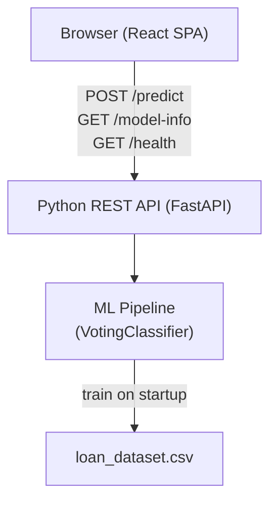

# Design Document: Loan Approval Prediction System

## Overview

The Loan Approval Prediction System replaces the existing Streamlit prototype with a production-oriented two-tier architecture:

- **Backend**: A Python REST API (FastAPI) that trains a `VotingClassifier` ensemble on startup and exposes `/predict`, `/health`, and `/model-info` endpoints.
- **Frontend**: A React single-page application that collects applicant inputs, validates them client-side, calls the API, and displays the prediction result with confidence score and model accuracy.

The system is designed for local or containerised deployment. The ML pipeline (imputation → encoding → training) runs once at startup; no model persistence is required for the initial version.

---

## Architecture



**Request flow:**

1. React app loads → fetches `GET /model-info` → displays accuracy.
2. Applicant fills form → client-side validation → `POST /predict` with Feature_Vector JSON.
3. API validates payload → runs `model.predict_proba` equivalent (hard voting) → returns `{prediction, confidence}`.
4. React displays result inline; on error/timeout shows human-readable message.

---

## Components and Interfaces

### Backend

#### `api/main.py` — FastAPI application entry point
- Registers startup event that triggers `ml/pipeline.py::train()`.
- Mounts CORS middleware with configurable allowed origins.
- Registers routers: `/predict`, `/health`, `/model-info`.

#### `api/routers/predict.py`
```
POST /predict
  Body: PredictRequest (11 numeric fields)
  Response 200: PredictResponse { prediction: str, confidence: float }
  Response 422: ValidationError { detail: [...] }
```

#### `api/routers/health.py`
```
GET /health
  Response 200: { "status": "ok" }
```

#### `api/routers/model_info.py`
```
GET /model-info
  Response 200: ModelInfoResponse {
    accuracy: float,
    estimators: list[str],
    feature_names: list[str]
  }
```

#### `api/schemas.py` — Pydantic models
- `PredictRequest`: 11 fields with `Field(gt=0)` constraints on income/amount/term.
- `PredictResponse`: `prediction: str`, `confidence: float`.
- `ModelInfoResponse`: `accuracy: float`, `estimators: list[str]`, `feature_names: list[str]`.

#### `ml/pipeline.py` — ML training pipeline
- `train(csv_path) -> TrainedModel`: loads CSV, imputes, encodes, splits 80/20 stratified, fits `VotingClassifier`, logs accuracy, returns model + metadata.
- `predict(model, feature_vector) -> tuple[str, float]`: runs prediction, computes confidence as fraction of estimators voting for majority class.

### Frontend

#### `src/components/LoanForm.tsx`
- Controlled form with all 11 fields.
- Inline validation on submit (empty check + positive-value check).
- On valid submit: calls `POST /predict`, shows `LoadingIndicator`, then renders `ResultCard`.
- On error/timeout: renders `ErrorMessage` with retry affordance.

#### `src/components/ModelInfo.tsx`
- Fetches `GET /model-info` on mount.
- Displays accuracy as a percentage badge.

#### `src/components/ResultCard.tsx`
- Displays `prediction` label (Approved / Rejected) and `confidence` as a percentage.

#### `src/api/client.ts`
- Thin wrapper around `fetch` with a 5-second `AbortController` timeout.
- Exports `predictLoan(featureVector)` and `getModelInfo()`.

---

## Data Models

### Feature Vector (ordered, 11 fields)

| Index | Field | Type | Encoding |
|-------|-------|------|----------|
| 0 | Gender | int | Male=1, Female=0 |
| 1 | Married | int | Yes=1, No=0 |
| 2 | Dependents | int | 0/1/2/3 (3+ → 3) |
| 3 | Education | int | Graduate=1, Not Graduate=0 |
| 4 | Self_Employed | int | Yes=1, No=0 |
| 5 | ApplicantIncome | float | raw value |
| 6 | CoapplicantIncome | float | raw value |
| 7 | LoanAmount | float | raw value (thousands) |
| 8 | Loan_Amount_Term | float | raw value (days) |
| 9 | Credit_History | int | Has=1, No=0 |
| 10 | Property_Area | int | Rural=0, Semiurban=1, Urban=2 |

### API Schemas (Pydantic)

```python
class PredictRequest(BaseModel):
    gender: int
    married: int
    dependents: int
    education: int
    self_employed: int
    applicant_income: float = Field(gt=0)
    coapplicant_income: float = Field(ge=0)
    loan_amount: float = Field(gt=0)
    loan_amount_term: float = Field(gt=0)
    credit_history: int
    property_area: int

class PredictResponse(BaseModel):
    prediction: str   # "Approved" | "Rejected"
    confidence: float # 0.0 – 1.0

class ModelInfoResponse(BaseModel):
    accuracy: float
    estimators: list[str]
    feature_names: list[str]
```

### Training Metadata (in-memory)

```python
@dataclass
class TrainedModel:
    classifier: VotingClassifier
    accuracy: float
    estimator_names: list[str]
    feature_names: list[str]
```

---

## Correctness Properties

*A property is a characteristic or behavior that should hold true across all valid executions of a system — essentially, a formal statement about what the system should do. Properties serve as the bridge between human-readable specifications and machine-verifiable correctness guarantees.*

### Property 1: Feature vector encoding is deterministic and reversible

*For any* valid combination of categorical and numeric applicant inputs, encoding them to a Feature_Vector and then mapping the Feature_Vector back to the original categorical labels SHALL produce the original input values.

**Validates: Requirements 2.1, 3.4**

---

### Property 2: Prediction output is always a valid label with a valid confidence

*For any* Feature_Vector of 11 numeric values within the accepted ranges, the `predict` function SHALL return a prediction that is exactly one of `"Approved"` or `"Rejected"` and a confidence score in the range `[0.0, 1.0]`.

**Validates: Requirements 2.2, 4.1**

---

### Property 3: API rejects incomplete or out-of-range payloads

*For any* request body that is missing one or more of the 11 required fields, or that contains a non-positive value for `applicant_income`, `loan_amount`, or `loan_amount_term`, the API SHALL return HTTP 422 and SHALL NOT invoke the model.

**Validates: Requirements 4.2, 4.3, 1.2, 1.3**

---

### Property 4: Model accuracy is logged and exposed consistently

*For any* training run on the same dataset with the same random seed, the accuracy value logged to stdout SHALL equal the accuracy value returned by `GET /model-info`.

**Validates: Requirements 3.6, 5.1**

---

### Property 5: Confidence score matches voting fraction

*For any* Feature_Vector, the `confidence` value returned by the API SHALL equal the fraction of base estimators (out of 3) that voted for the majority class (i.e., one of `{1/3, 2/3, 1.0}`).

**Validates: Requirements 2.2**

---

## Error Handling

| Scenario | Backend behaviour | Frontend behaviour |
|---|---|---|
| Missing field in POST body | HTTP 422, JSON listing missing fields | Inline validation; request never sent |
| Non-positive numeric field | HTTP 422, descriptive message | Inline validation; request never sent |
| Model not yet loaded (race) | HTTP 503 `{"detail": "Model not ready"}` | Display generic error, allow retry |
| CSV not found at startup | Log error, exit with non-zero code | N/A |
| API timeout (>5 s) | — | AbortController fires; show timeout message |
| API HTTP error (4xx/5xx) | Structured JSON error body | Parse `detail` field; show human-readable message |
| Accuracy below 70% | Log WARNING to stdout | No UI change (server-side concern only) |

---

## Testing Strategy

### Unit Tests (pytest)

- `ml/pipeline.py::train()`: assert model type, feature count, accuracy is a float in `[0, 1]`.
- `ml/pipeline.py::predict()`: assert output label is in `{"Approved", "Rejected"}`, confidence in `[0, 1]`.
- `api/schemas.py`: assert Pydantic validation rejects missing fields and non-positive values.
- Encoding maps: assert each categorical value maps to the expected integer.

### Property-Based Tests (Hypothesis, Python)

Property tests use `hypothesis` with `@settings(max_examples=100)`.

Each test is tagged with a comment in the format:
`# Feature: loan-approval-prediction-system, Property N: <property_text>`

- **Property 1** — Generate random valid categorical + numeric inputs, encode to Feature_Vector, decode back, assert round-trip equality.
- **Property 2** — Generate random valid Feature_Vectors (11 floats in range), call `predict`, assert label ∈ `{"Approved","Rejected"}` and confidence ∈ `[0.0, 1.0]`.
- **Property 3** — Generate payloads with at least one missing or out-of-range field, POST to test client, assert HTTP 422.
- **Property 4** — Train model with fixed seed, compare logged accuracy to `/model-info` accuracy, assert equality.
- **Property 5** — Generate Feature_Vectors, call `predict`, assert confidence ∈ `{1/3, 2/3, 1.0}` (hard voting with 3 estimators).

### Integration Tests

- Full startup → `GET /health` returns 200.
- `POST /predict` with a known fixture input returns expected label (smoke check against historical data).
- `GET /model-info` returns all required fields with correct types.
- CORS headers present on responses.

### Frontend Tests (Vitest + React Testing Library)

- `LoanForm`: submitting with empty fields shows validation errors and does not call `fetch`.
- `LoanForm`: submitting with non-positive income shows validation error.
- `LoanForm`: successful API response renders `ResultCard` with prediction and confidence.
- `LoanForm`: API timeout renders error message with retry button.
- `ModelInfo`: renders accuracy percentage from mocked `/model-info` response.
- Accessibility: every input has an associated `<label>`; first invalid field receives focus on submit.
